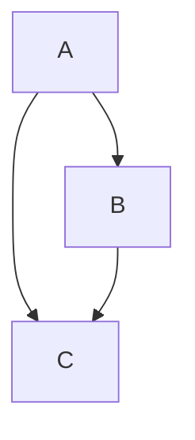
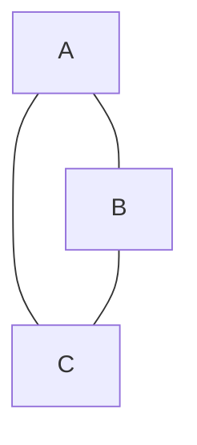

## An Example of Converting a Bayesian Network to a Markov Network

Consider a simple Bayesian network with three nodes: A, B, and C. Node A has no parents, node B has A as its parent, and node C has A and B as its parents. Let's assume the following CPDs:

P(A):
|  A  | P(A) |
|-----|------|
|  a1 |  0.6 |
|  a2 |  0.4 |

P(C|A,B):
|  A  |  B  |  C  | P(C|A,B) |
|-----|-----|-----|----------|
|  a1 |  b1 |  c1 |    0.8   |
|  a1 |  b1 |  c2 |    0.2   |
|  a1 |  b2 |  c1 |    0.4   |
|  a1 |  b2 |  c2 |    0.6   |
|  a2 |  b1 |  c1 |    0.3   |
|  a2 |  b1 |  c2 |    0.7   |
|  a2 |  b2 |  c1 |    0.9   |
|  a2 |  b2 |  c2 |    0.1   |

Now, let's convert this Bayesian network to a Markov network.

**Moralization:** Connect all pairs of nodes that have a common child, creating an undirected edge between them if it doesn't already exist. In this case, nodes A and B are both parents of C, so we add an undirected edge between A and B.

**Removal of directed edges:** Remove the direction from all remaining directed edges in the original BN. Now you have an undirected graph representing the relationships between the variables.

Consider a simple Bayesian network with three nodes: A, B, and C. Node A has no parents, node B has A as its parent, and node C has A and B as its parents. Let's assume the following CPDs:

P(A):
|  A  | P(A) |
|-----|------|
|  a1 |  0.6 |
|  a2 |  0.4 |

P(B|A):
|  A  |  B  | P(B|A) |
|-----|-----|-------|
|  a1 |  b1 |   0.7  |
|  a1 |  b2 |   0.3  |
|  a2 |  b1 |   0.4  |
|  a2 |  b2 |   0.6  |

P(C|A,B):
|  A  |  B  |  C  | P(C|A,B) |
|-----|-----|-----|----------|
|  a1 |  b1 |  c1 |    0.8   |
|  a1 |  b1 |  c2 |    0.2   |
|  a1 |  b2 |  c1 |    0.4   |
|  a1 |  b2 |  c2 |    0.6   |
|  a2 |  b1 |  c1 |    0.3   |
|  a2 |  b1 |  c2 |    0.7   |
|  a2 |  b2 |  c1 |    0.9   |
|  a2 |  b2 |  c2 |    0.1   |
The Bayesian network can be visualized using Mermaid as follows:

Now, let's convert this Bayesian network to a Markov network.

Moralization: Connect all pairs of nodes that have a common child, creating an undirected edge between them if it doesn't already exist. In this case, nodes A and B are both parents of C, so we add an undirected edge between A and B.

Removal of directed edges: Remove the direction from all remaining directed edges in the original BN. Now you have an undirected graph representing the relationships between the variables.

The Markov network can be visualized using Mermaid as follows:

**Potential functions:** Represent the conditional probability distributions (CPDs) from the Bayesian network as potential functions in the Markov network. For each CPD in the Bayesian network, create a potential function over the corresponding clique in the Markov network, which consists of the variable and its parents in the original BN. In this case, we have three potential functions:

ψ(A)
ψ(A, B)
ψ(A, B, C)

The potential functions are defined as:

ψ(A):
|  A  | ψ(A) |
|-----|------|
|  a1 |  0.6 |
|  a2 |  0.4 |

ψ(A):
|  A  | ψ(A) |
|-----|------|
|  a1 |  0.6 |
|  a2 |  0.4 |

ψ(A, B):
|  A  |  B  | ψ(A, B) |
|-----|-----|--------|
|  a1 |  b1 |   0.42  |
|  a1 |  b2 |   0.18  |
|  a2 |  b1 |   0.24  |
|  a2 |  b2 |   0.36  |

ψ(A, B, C):
|  A  |  B  |  C  | ψ(A, B, C) |
|-----|-----|-----|-----------|
|  a1 |  b1 |  c1 |    0.336   |
|  a1 |  b1 |  c2 |    0.084   |
|  a1 |  b2 |  c1 |    0.072   |
|  a1 |  b2 |  c2 |    0.108   |
|  a2 |  b1 |  c1 |    0.072   |
|  a2 |  b1 |  c2 |    0.168   |
|  a2 |  b2 |  c1 |    0.324   |
|  a2 |  b2 |  c2 |    0.036   |

**Normalize:** Note that unlike Bayesian networks, the potential functions in a Markov network don't directly represent probabilities. Instead, the joint probability distribution over all variables can be derived from the product of all potential functions, normalized by a partition function (Z). The partition function is the sum of the product of potential functions over all possible variable assignments.
In this case, we can derive the joint probability distribution by multiplying the potential functions and dividing by the partition function Z:

$P(A, B, C) = \frac{1}{Z} \times \psi(A) \times \psi(A, B) \times \psi(A, B, C)$

To compute Z, we sum the product of the potential functions over all possible combinations of A, B, and C:

$Z = \sum_{A, B, C} \psi(A) \times \psi(A, B) \times \psi(A, B, C)$

For our example:

$Z = 0.6 \times 0.42 \times 0.336 + 0.6 \times 0.42 \times 0.084 + ... + 0.4 \times 0.36 \times 0.036 = 1$

Since the partition function Z equals 1, the joint probability distribution over A, B, and C is equal to the product of the potential functions:

$P(A, B, C) = \psi(A) \times \psi(A, B) \times \psi(A, B, C)$

This completes the conversion of the Bayesian network to a Markov network.
