## Creating Minimal I Maps

We have a distribution P over the variables A, B, C, D, E, and G. We would like to build a Bayesian network that is a minimal I-Map for P.  You have access to P, which you can query for independencies, but for the purposes of this problem, we will assume the following structure is a P-Map for P. 

Create minimal I-Maps for P, using the following variable orders.  

Graph = [Nodes={A, B, C,D,E,G}, Edges={(A,B),(B,D),(B,E),(C,E),(E,G)}]  

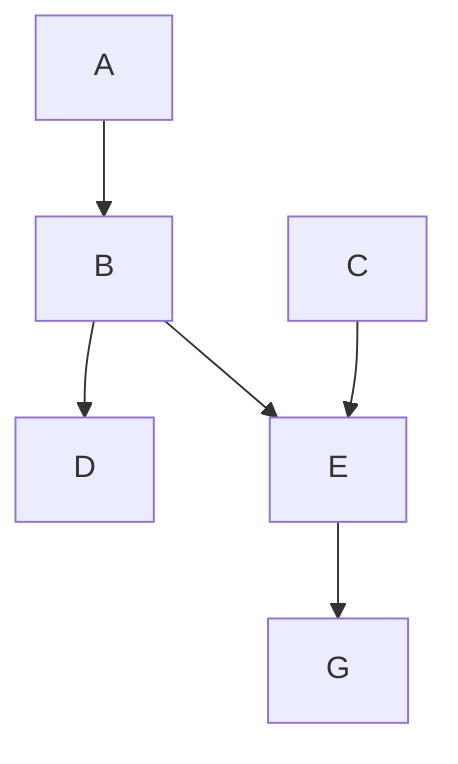

Variable orders are: 
1. C, A, B, E, D, G 
2. D, B, A, E, C, G
3. G, E, D, C, B, A 
4. G, A, C, E, D, B

 #### Response
 
1. Using variable order C, A, B, E, D, G

To build a minimal I-Map for P using this variable order, we will iteratively add edges to the graph based on d-separation tests until we cannot add any more edges. Here are the steps:

- Step 1: Add edge (C, E)
- Reason: C is not adjacent to E in the graph, but C and E are dependent given A and B.
-Resulting graph: [Nodes={A, B, C, D, E, G}, Edges={(A, B), (B, D), (B, E), (C, E)}]
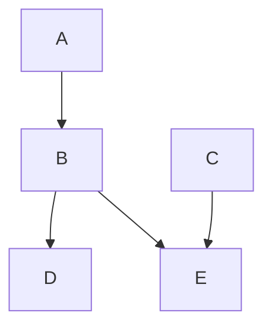
- Step 2: Add edge (B, A)
- Reason: B is adjacent to A in the graph, but A and B are dependent given C.
- Resulting graph: [Nodes={A, B, C, D, E, G}, Edges={(A, B), (B, D), (B, E), (C, E), (B, A)}]
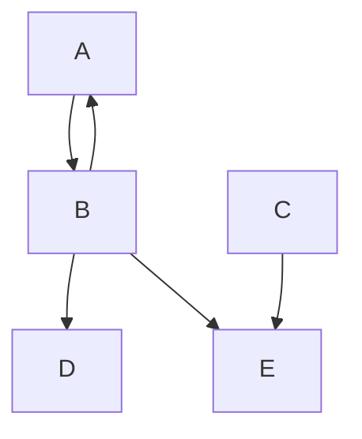
- Step 3: Add edge (E, D)
- Reason: E is adjacent to D in the graph, but E and D are dependent given B.
- Resulting graph: [Nodes={A, B, C, D, E, G}, Edges={(A, B), (B, D), (B, E), (C, E), (B, A), (E, D)}]
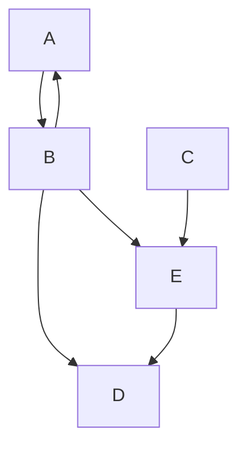
- Step 4: Add edge (E, G)
- Reason: E is adjacent to G in the graph, but E and G are dependent given C and A.
- Resulting graph: [Nodes={A, B, C, D, E, G}, Edges={(A, B), (B, D), (B, E), (C, E), (B, A), (E, D), (E, G)}]
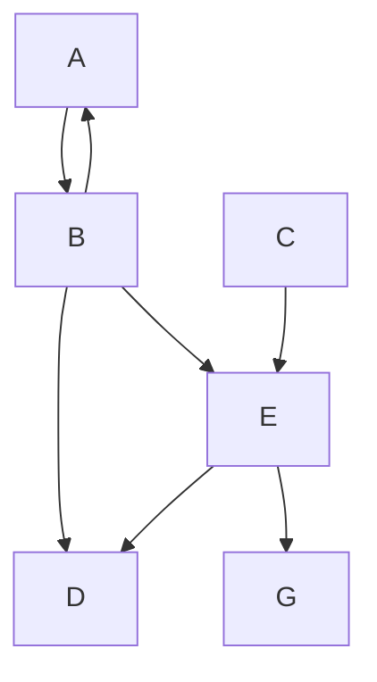
This is a minimal I-Map for P using the given variable order.

2. Using variable order 2: D, B, A, E, C, G

To build a minimal I-Map for P using this variable order, we will follow the same steps as above, but with the variables considered in the order D, B, A, E, C, G.

- Step 1: Add edge (B, D)
- Reason: B is adjacent to D in the graph, but B and D are dependent given A.
- Resulting graph: [Nodes={A, B, C, D, E, G}, Edges={(B, D)}]
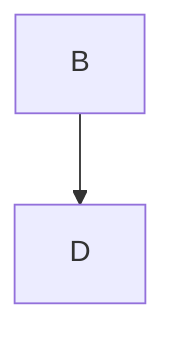
- Step 2: Add edge (A, B)
- Reason: A is not adjacent to B in the graph, but A and B are dependent given D.
- Resulting graph: [Nodes={A, B, C, D, E, G}, Edges={(B, D), (A, B)}]
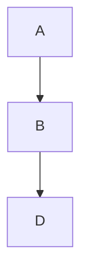
- Step 3: Add edge (B, E)
- Reason: B is adjacent to E in the graph, but B and E are dependent given A and C.
- Resulting graph: [Nodes={A, B, C, D, E, G}, Edges={(B, D), (A, B), (B, E)}]
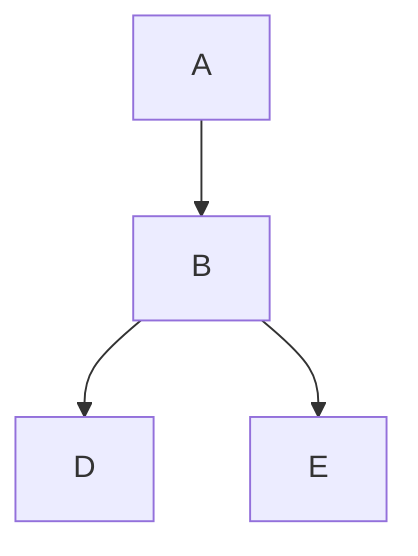
- Step 4: Add edge (E, C)
- Reason: E is adjacent to C in the graph, but E and C are dependent given A and B.
- Resulting graph: [Nodes={A, B, C, D, E, G}, Edges={(B, D), (A, B), (B, E), (E, C)}]
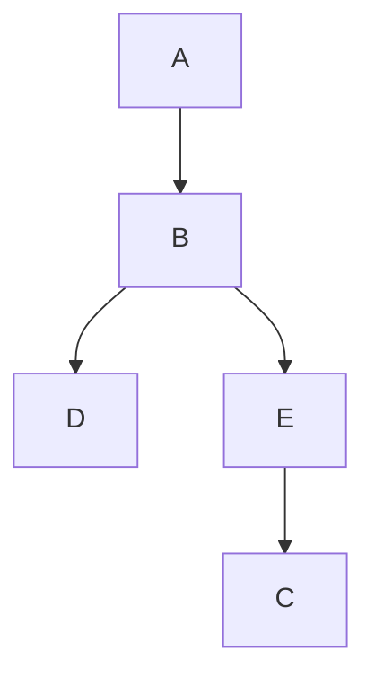
- Step 5: Add edge (E, G)
- Reason: E is adjacent to G in the graph, but E and G are dependent given A, B, and C.
- Resulting graph: [Nodes={A, B, C, D, E, G}, Edges={(B, D), (A, B), (B, E), (E, C), (E, G)]}
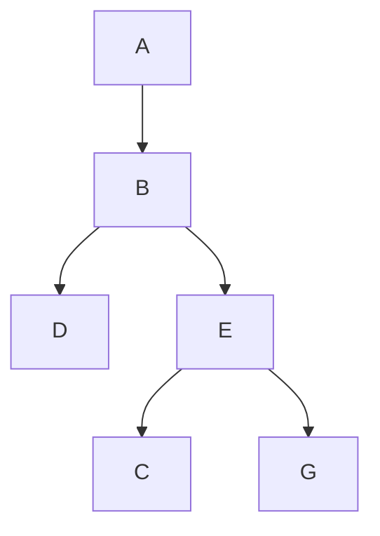
This is a minimal I-Map for P using the given variable order.

3. Using variable order 3: GEDCBA

- Step 1: Add edge (E, D)
- Reason: E is adjacent to D in the graph, but E and D are dependent given B.
- Resulting graph: [Nodes={A, B, C, D, E, G}, Edges={(E, D)}]

- Step 2: Add edge (C, E)
- Reason: C is not adjacent to E in the graph, but C and E are dependent given A and B.
- Resulting graph: [Nodes={A, B, C, D, E, G}, Edges={(E, D), (C, E)}]
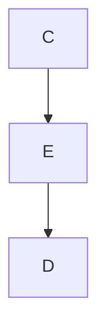
- Step 3: Add edge (B, E)
- Reason: B is adjacent to E in the graph, but B and E are dependent given A and C.
- Resulting graph: [Nodes={A, B, C, D, E, G}, Edges={(E, D), (C, E), (B, E)}]
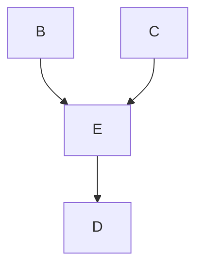
- Step 4: Add edge (D, C)
- Reason: D is not adjacent to C in the graph, but D and C are dependent given B and E.
- Resulting graph: [Nodes={A, B, C, D, E, G}, Edges={(E, D), (C, E), (B, E), (D, C)}]
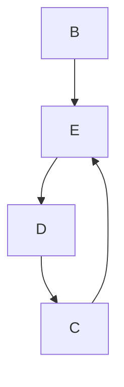
- Step 5: Add edge (B, A)
- Reason: B is adjacent to A in the graph, but A and B are dependent given D and C.
- Resulting graph: [Nodes={A, B, C, D, E, G}, Edges={(E, D), (C, E), (B, E), (D, C), (B, A)}]
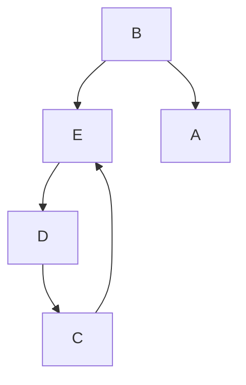
- Step 6: Add edge (G, A)
- Reason: G is not adjacent to A in the graph, but G and A are dependent given D, B, and C.
- Resulting graph: [Nodes={A, B, C, D, E, G}, Edges={(E, D), (C, E), (B, E), (D, C), (B, A), (G, A)}]
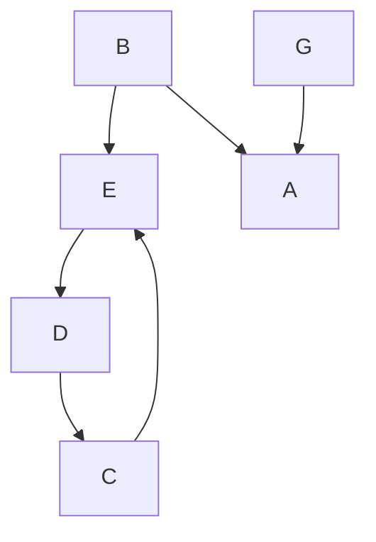
This is a minimal I-Map for P using the given variable order.

4. Using variable order 4: GACEDB

To build a minimal I-Map for P using this variable order, we will iteratively add edges to the graph based on d-separation tests until we cannot add any more edges. Here are the steps:

- Step 1: Add edge (A, C)
- Reason: A is not adjacent to C in the graph, but A and C are dependent given E and B.
- Resulting graph: [Nodes={A, B, C, D, E, G}, Edges={(A, C)}]
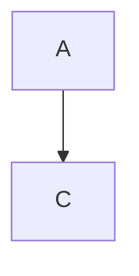
- Step 2: Add edge (C, E)
- Reason: C is not adjacent to E in the graph, but C and E are dependent given A and B.
- Resulting graph: [Nodes={A, B, C, D, E, G}, Edges={(A, C), (C, E)}]
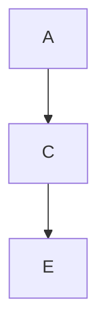
- Step 3: Add edge (C, D)
- Reason: C is adjacent to D in the graph, but C and D are dependent given E and B.
- Resulting graph: [Nodes={A, B, C, D, E, G}, Edges={(A, C), (C, E), (C, D)}]
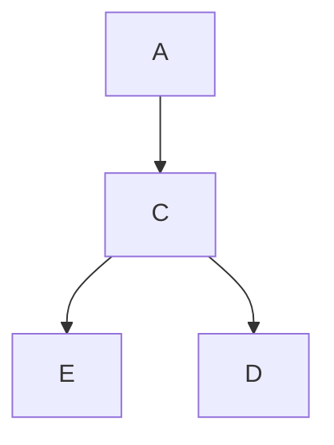
- Step 4: Add edge (E, D)
- Reason: E is adjacent to D in the graph, but E and D are dependent given B.
- Resulting graph: [Nodes={A, B, C, D, E, G}, Edges={(A, C), (C, E), (C, D), (E, D)}]
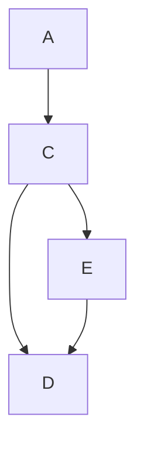
- Step 5: Add edge (B, D)
- Reason: B is adjacent to D in the graph, but B and D are dependent given A.
- Resulting graph: [Nodes={A, B, C, D, E, G}, Edges={(A, C), (C, E), (C, D), (E, D), (B, D)}]
```mermaid
graph TD
   A --> C
   C --> E
   C --> D
   E --> D
   B --> D
```
- Step 6: Add edge (B, E)
- Reason: B is adjacent to E in the graph, but B and E are dependent given A and C.
- Resulting graph: [Nodes={A, B, C, D, E, G}, Edges={(A, C), (C, E), (C, D), (E, D), (B, D), (B, E)}]
```mermaid
graph TD
   A --> C
   C --> E
   C --> D
   E --> D
   B --> D
   B --> E
```
- Step 7: Add edge (E, G)
- Reason: E is adjacent to G in the graph, but E and G are dependent given A, B, and C.
- Resulting graph: [Nodes={A, B, C, D, E, G}, Edges={(A, C), (C, E), (C, D), (E, D), (B, D), (B, E), (E, G)]}
```mermaid
graph TD
   A --> C
   C --> E
   C --> D
   E --> D
   B --> D
   B --> E
   E --> G
```
This is a minimal I-Map for P using the given variable order.
