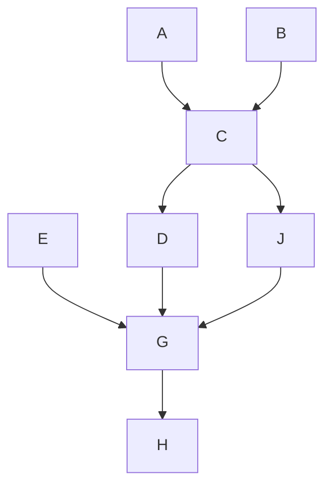

## Factorization

### The Graph

- Nodes = {A, B, C, D, E, J, G, H}
- Edges = {AC, BC, CD, CJ, EG, DG, JG, GH}

### The Joint Distribution as a Factorization Over a Bayesian Network

$$P(A,B,C,D,E,J,G,H) = P(A) * P(B) * P(C | A,B) * P(D | C) * P(E) * P(J | C) * P(G | E,D,J) * P(H | G)$$

### Independent Parameters

- Assuming each variable is discrete and can take n possible values, the number of independent parameters needed for this Bayesian network is:

$$nP(C | A,B) * nP(D | C) * n(D|C) * n(J|C) * n(E|G) * n(D|C,G) * P(G | E,D,J)* n(P(H | G)$$

### Independence Statements

1. A is independent of B
- False. A and B are not d-separated in the graph, so they are not independent.
2. A is independent of B given C
- True. A and B are d-separated by C, so they are conditionally independent given C.
3. A is independent of B given J
- False. A and B are not d-separated by J or any other set of variables, so they are not conditionally independent given J.
4. A is independent of B given G
- False. A and B are not d-separated by G or any other set of variables, so they are not conditionally independent given G.
5. A is independent of B given E
- False. A and B are not d-separated by E or any other set of variables, so they are not conditionally independent given E.
6. A is independent of B given H
- False. A and B are not d-separated by H or any other set of variables, so they are not conditionally independent given H.
7. A is independent of H
- False. A and H are not d-separated in the graph, so they are not independent.
8. A is independent of H given J
- True. A and H are d-separated by J, so they are conditionally independent given J.
9. A is independent of H given D,J
- True. A and H are d-separated by D and J, so they are conditionally independent given D and J.
10. D is independent of J
- True. D and J are d-separated by C, so they are conditionally independent given C.
11. B is independent of E
- False. B and E are not d-separated in the graph, so they are not independent.
12. B is independent of E given J
- False. B and E are not d-separated by J or any other set of variables, so they are not conditionally independent given J.
13. B is independent of E given J, H
- True. B and E are d-separated by J and H, so they are conditionally independent given J and H.
