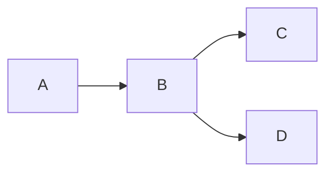
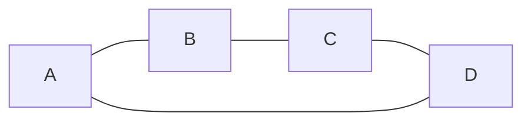
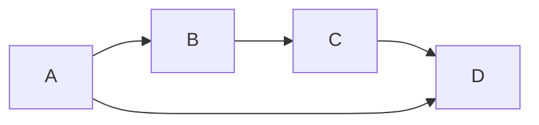
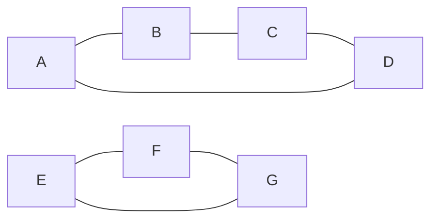
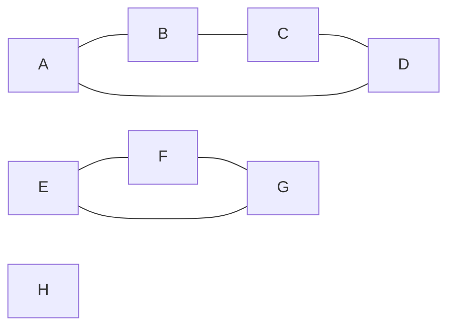

# Graph Theory Concepts

Graph theory is the study of graphs, which are mathematical structures used to model pairwise relations between objects.

## Graphs

A graph is a collection of vertices (or nodes) and edges, where edges represent connections between vertices.

**Undirected Graphs**
In an undirected graph, edges have no direction, meaning that the connections between vertices are bidirectional.

**Directed Graphs**
In a directed graph (also called a "digraph"), edges have a direction, meaning that connections between vertices are unidirectional.

**Cliques**
A clique is a subset of vertices in an undirected graph such that every pair of distinct vertices in the clique is connected by an edge.

In the above graph, {A, B, C, D} and {E, F, G} are cliques.

**Maximal Clique**
A maximal clique is a clique that cannot be extended by adding an adjacent vertex.

In the above graph, {A, B, C, D} and {E, F, G} are maximal cliques.

**Maximum Clique**
A maximum clique is a clique of the largest possible size in a given graph.

In the above graph, {A, B, C, D} and {E, F, G} are maximum cliques.

**Clique Cover**
A clique cover is a partition of a graph's vertices into a set of cliques.

In the above graph, {{A, B, C, D}, {E, F, G}} is a clique cover.

**Clique Number**
The clique number (ω) of a graph is the size of the largest clique in the graph.

In the above graph, the clique number ω = 3.

the end.
