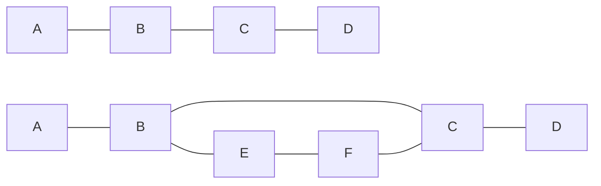

# Independence in Bayesian and Markov Networks

Independence in Bayesian and Markov networks can be determined using the concept of d-separation (directed-separation) and separation, respectively.

## D-separation in Bayesian Networks

D-separation is a criterion used to identify conditional independence between variables in Bayesian networks. Given a Bayesian network, two variables X and Y are conditionally independent given a set of variables Z if and only if they are d-separated by Z.

There are three possible configurations for d-separation:

1. Causal (chain) structure: A → B → C
2. Evidential (fork) structure: A ← B → C
3. Common cause (collider) structure: A → B ← C

D-separation is a criterion used in Bayesian networks to determine whether two sets of nodes (variables) are conditionally independent given a third set of nodes (observed variables). To perform d-separation, you need to analyze the paths between nodes in the directed acyclic graph (DAG) representing the Bayesian network.

Here's a step-by-step guide to perform d-separation:

1. Identify the sets of nodes: Determine the two sets of nodes (X and Y) whose conditional independence you want to test, and the set of observed nodes (Z).

2. Find all paths between the nodes in X and Y: A path is an unbroken sequence of connected nodes in the graph. Identify all paths that connect any node in X to any node in Y.

3. Check for blocked paths: A path is considered blocked with respect to the observed nodes Z if it meets either of these conditions:

a. The path contains a chain (A → B → C) or a fork (A ← B → C), and the middle node B is observed (i.e., B is in Z).

b. The path contains a collider (A → B ← C), and neither the middle node B nor any of its descendants are observed (i.e., neither B nor its descendants are in Z).

**Determine d-separation:** 

If all paths between the nodes in X and Y are blocked with respect to Z, then X and Y are d-separated by Z, which implies that X and Y are conditionally independent given Z. If there is at least one unblocked path, then X and Y are not d-separated by Z, meaning that they are not conditionally independent given Z.

By following these steps and analyzing the paths in the DAG, you can determine whether two sets of nodes are conditionally independent given a set of observed nodes using the d-separation criterion.

## Directions in Graph Nodes
A1[A] --> B1[B] --> C1[C] 

A2[A] <-- B2[B] --> C2[C]

A3[A] --> B3[B] <-- C3[C]

For causal and evidential structures, X and Y are d-separated by Z if Z includes the middle node. For the common cause structure, X and Y are d-separated by Z if Z does not include the middle node or any of its descendants.

## Separation in Markov Networks
In Markov networks, separation is determined using the concept of an undirected path between two nodes. Two nodes are separated if there is no undirected path between them that passes through a node in the conditioning set.

In the first Markov network, A and D are separated by {B, C}, while in the second Markov network, A and D are not separated by {B, C}, because there is an alternate path A → B → E → F → C → D that doesn't go through B or C.
