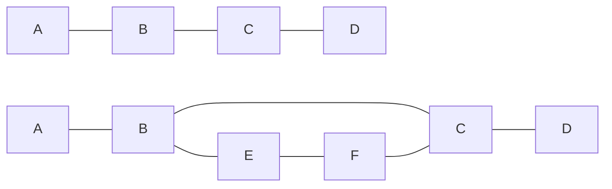

# Independence in Bayesian and Markov Networks

Independence in Bayesian and Markov networks can be determined using the concept of d-separation (directed-separation) and separation, respectively.

## D-separation in Bayesian Networks

D-separation is a criterion used to identify conditional independence between variables in Bayesian networks. Given a Bayesian network, two variables X and Y are conditionally independent given a set of variables Z if and only if they are d-separated by Z.

There are three possible configurations for d-separation:

1. Causal (chain) structure: A → B → C
2. Evidential (fork) structure: A ← B → C
3. Common cause (collider) structure: A → B ← C


```mermaid
graph TD
A1[A] --> B1[B] --> C1[C]
A2[A] <-- B2[B] --> C2[C]
A3[A] --> B3[B] <-- C3[C]
```

For causal and evidential structures, X and Y are d-separated by Z if Z includes the middle node. For the common cause structure, X and Y are d-separated by Z if Z does not include the middle node or any of its descendants.

## Separation in Markov Networks
In Markov networks, separation is determined using the concept of an undirected path between two nodes. Two nodes are separated if there is no undirected path between them that passes through a node in the conditioning set.


In the first Markov network, A and D are separated by {B, C}, while in the second Markov network, A and D are not separated by {B, C}, because there is an alternate path A → B → E → F → C → D that doesn't go through B or C.
