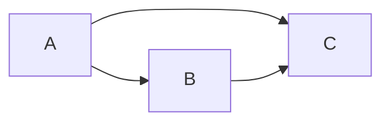

## Markov to Bayesian Network Example

Let's consider a simple Markov Network (Undirected Graphical Model) with three variables A, B, and C, and their respective pairwise potentials.

Our Markov Network looks like this:

A -- B
|    |
C -- B

Here, the pairwise potentials are:

ψ(A, B)
ψ(B, C)
ψ(A, C)
To convert this Markov Network into a Bayesian Network (Directed Graphical Model) with Conditional Probability Distributions (CPDs), we need to select an ordering for the variables and choose a direction for the edges. Let's choose the ordering A, B, C.

The Bayesian Network would look like this:

A
↓
B
↓
C

Now, we need to determine the CPDs for each variable based on the given pairwise potentials. Since we chose A as the first variable in the ordering, its CPD is simply its marginal distribution:

P(A) = α * Σ(Σ(ψ(A, B) * ψ(B, C) * ψ(A, C), B), C)
For the CPDs of B and C, we use the following formula:

P(B | A) = β * Σ(ψ(A, B) * ψ(B, C) * ψ(A, C), C)
P(C | B, A) = γ * ψ(A, B) * ψ(B, C) * ψ(A, C)
In the above CPDs, α, β, and γ are normalization constants to ensure the probabilities sum up to 1.

To summarize, we have converted the Markov Network into a Bayesian Network with the following structure and CPDs:

A
↓
B
↓
C

P(A) = α * Σ(Σ(ψ(A, B) * ψ(B, C) * ψ(A, C), B), C)
P(B | A) = β * Σ(ψ(A, B) * ψ(B, C) * ψ(A, C), C)
P(C | B, A) = γ * ψ(A, B) * ψ(B, C) * ψ(A, C)
Keep in mind that this is just one possible ordering and resulting Bayesian Network. The specific ordering and structure you choose may depend on the problem domain and your specific requirements.

## Summary

Let's assume we have the following sample data for our Markov Network (Undirected Graphical Model) with three binary variables A, B, and C, and their respective pairwise potentials:

ψ(A, B) = { (0, 0): 0.8, (0, 1): 0.2, (1, 0): 0.3, (1, 1): 0.7 }
ψ(B, C) = { (0, 0): 0.9, (0, 1): 0.1, (1, 0): 0.4, (1, 1): 0.6 }
ψ(A, C) = { (0, 0): 0.7, (0, 1): 0.3, (1, 0): 0.6, (1, 1): 0.4 }

We will choose the same ordering as before: A, B, C.

Our Markov Network looks like this (you can visualize it using a tool like Graphviz):

A -- B
|    |
C -- B

The Bayesian Network would look like this:

A
↓
B
↓
C

Now, we need to determine the CPDs for each variable based on the given pairwise potentials:

P(A) = α * Σ(Σ(ψ(A, B) * ψ(B, C) * ψ(A, C), B), C)
Let's compute the values for each possible state of A:

P(A=0) = α * (ψ(0, 0) * ψ(0, 0) * ψ(0, 0) + ψ(0, 0) * ψ(0, 1) * ψ(0, 1) + ψ(0, 1) * ψ(1, 0) * ψ(0, 0) + ψ(0, 1) * ψ(1, 1) * ψ(0, 1)) = α * (0.8 * 0.9 * 0.7 + 0.8 * 0.1 * 0.3 + 0.2 * 0.4 * 0.7 + 0.2 * 0.6 * 0.3) = α * 0.754
P(A=1) = α * (ψ(1, 0) * ψ(0, 0) * ψ(1, 0) + ψ(1, 0) * ψ(0, 1) * ψ(1, 1) + ψ(1, 1) * ψ(1, 0) * ψ(1, 0) + ψ(1, 1) * ψ(1, 1) * ψ(1, 1)) = α * (0.3 * 0.9 * 0.6 + 0.3 * 0.1 * 0.4 + 0.7 * 0.4 * 0.6 + 0.7 * 0.6 * 0.4) = α * 0.746
To ensure the probabilities sum up to 1, we need to find the normalization constant α:

α = 1 / (0.754 + 0.746) ≈ 0.668

So, P(A) becomes:

P(A=0) ≈ 0.668 * 0.754 ≈ 0.504
P(A=1) ≈ 0.668 * 0.746 ≈ 0.496
P(B | A) = β * Σ(ψ(A, B) * ψ(B, C) * ψ(A, C), C)
We compute the values for each possible state of B given A:

P(B=0 | A=0) = β * (ψ(0, 0) * ψ(0, 0) * ψ(0, 0) + ψ(0, 0) * ψ(0, 1) * ψ(0, 1)) = β * (0.8 * 0.9 * 0.7 + 0.8 * 0.1 * 0.3) ≈ β * 0.565
P(B=1 | A=0) = β * (ψ(0, 1) * ψ(1, 0) * ψ(0, 0) + ψ(0, 1) * ψ(1, 1) * ψ(0, 1)) = β * (0.2 * 0.4 * 0.7 + 0.2 * 0.6 * 0.3) ≈ β * 0.146
P(B=0 | A=1) = β * (ψ(1, 0) * ψ(0, 0) * ψ(1, 0) + ψ(1, 0) * ψ(0, 1) * ψ(1, 1)) = β * (0.3 * 0.9 * 0.6 + 0.3 * 0.1 * 0.4) ≈ β * 0.189
P(B=1 | A=1) = β * (ψ(1, 1) * ψ(1, 0) * ψ(1, 0) + ψ(1, 1) * ψ(1, 1) * ψ(1, 1)) = β * (0.7 * 0.4 * 0.6 + 0.7 * 0.6 * 0.4) ≈ β * 0.647
Since we need to normalize the probabilities for B given each state of A:

β (when A=0) = 1 / (0.565 + 0.146) ≈ 1.503
β (when A=1) = 1 / (0.189 + 0.647) ≈ 1.191
So, P(B | A) becomes:

P(B=0 | A=0) ≈ 1.503 * 0.565 ≈ 0.850
P(B=1 | A=0) ≈ 1.503 * 0.146 ≈ 0.150
P(B=0 | A=1) ≈ 1.191 * 0.189 ≈ 0.225
P(B=1 | A=1) ≈ 1.191 * 0.647 ≈ 0.775

Since we already have the pairwise potentials, we can compute P(C | B, A) directly using the formula:

P(C | B, A) = γ * ψ(A, B) * ψ(B, C) * ψ(A, C)
We compute the values for each possible state of C given B and A:

P(C=0 | B=0, A=0) = γ * ψ(0, 0) * ψ(0, 0) * ψ(0, 0) = γ * 0.8 * 0.9 * 0.7 ≈ γ * 0.504
P(C=1 | B=0, A=0) = γ * ψ(0, 0) * ψ(0, 1) * ψ(0, 1) = γ * 0.8 * 0.1 * 0.3 ≈ γ * 0.024
P(C=0 | B=1, A=0) = γ * ψ(0, 1) * ψ(1, 0) * ψ(0, 0) = γ * 0.2 * 0.4 * 0.7 ≈ γ * 0.056
P(C=1 | B=1, A=0) = γ * ψ(0, 1) * ψ(1, 1) * ψ(0, 1) = γ * 0.2 * 0.6 * 0.3 ≈ γ * 0.036
P(C=0 | B=0, A=1) = γ * ψ(1, 0) * ψ(0, 0) * ψ(1, 0) = γ * 0.3 * 0.9 * 0.6 ≈ γ * 0.162
P(C=1 | B=0, A=1) = γ * ψ(1, 0) * ψ(0, 1) * ψ(1, 1) = γ * 0.3 * 0.1 * 0.4 ≈ γ * 0.012
P(C=0 | B=1, A=1) = γ * ψ(1, 1) * ψ(1, 0) * ψ(1, 0) = γ * 0.7 * 0.4 * 0.6 ≈ γ * 0.168
P(C=1 | B=1, A=1) = γ * ψ(1, 1) * ψ(1, 1) * ψ(1, 1) = γ * 0.7 * 0.6 * 0.4 ≈ γ * 0.168
Since we need to normalize the probabilities for C given each state of B and A:

γ (when B=0, A=0) = 1 / (0.504 + 0.024) ≈ 1.923
γ (when B=1, A=0) = 1 / (0.056 + 0.036) ≈ 9.091
γ (when B=0, A=1) = 1 / (0.162 + 0.012) ≈ 5.660
γ (when B=1, A=1) = 1 / (0.168 + 0.168) ≈ 2.976

Now, we can compute P(C | B, A):

P(C=0 | B=0, A=0) ≈ 1.923 * 0.504 ≈ 0.953
P(C=1 | B=0, A=0) ≈ 1.923 * 0.024 ≈ 0.047
P(C=0 | B=1, A=0) ≈ 9.091 * 0.056 ≈ 0.509
P(C=1 | B=1, A=0) ≈ 9.091 * 0.036 ≈ 0.491
P(C=0 | B=0, A=1) ≈ 5.660 * 0.162 ≈ 0.931
P(C=1 | B=0, A=1) ≈ 5.660 * 0.012 ≈ 0.069
P(C=0 | B=1, A=1) ≈ 2.976 * 0.168 ≈ 0.500
P(C=1 | B=1, A=1) ≈ 2.976 * 0.168 ≈ 0.500

Markov Network:

A -- B
|    |
C -- B

A
↓
B
↓
C

A
↓
B
↓
C

P(A):
- P(A=0) ≈ 0.504
- P(A=1) ≈ 0.496

P(B | A):
- P(B=0 | A=0) ≈ 0.850
- P(B=1 | A=0) ≈ 0.150
- P(B=0 | A=1) ≈ 0.225
- P(B=1 | A=1) ≈ 0.775

P(C | B, A):
- P(C=0 | B=0, A=0) ≈ 0.953
- P(C=1 | B=0, A=0) ≈ 0.047
- P(C=0 | B=1, A=0) ≈ 0.509
- P(C=1 | B=1, A=0) ≈ 0.491
- P(C=0 | B=0, A=1) ≈ 0.931
- P(C=1 | B=0, A=1) ≈ 0.069
- P(C=0 | B=1, A=1) ≈ 0.500
- P(C=1 | B=1, A=1) ≈ 0.500
