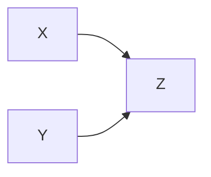

## P MAP (Perfect Map)

How to find a Bayesian network structure that is a P-MAP (Perfect MAP) for it.

Suppose we have a joint probability distribution H over three random variables X, Y, and Z:

H(X, Y, Z) = P(X, Y, Z)

From the distribution, we find the following independencies:

X is independent of Y: X ⊥ Y
X is independent of Z given Y: X ⊥ Z | Y
Y is independent of Z given X: Y ⊥ Z | X
Based on these independencies, we can build a P-MAP (Perfect MAP) Bayesian network structure G that captures the same set of independencies.

One possible P-MAP for H is:

In this structure, X and Y are independent, as there is no direct link between them. X is independent of Z given Y, because when we know Y, Z blocks the path between X and Z, satisfying the second independence. Similarly, Y is independent of Z given X, as when we know X, Z blocks the path between Y and Z, satisfying the third independence.

This Bayesian network structure G is a P-MAP for H, as it represents the same set of independencies as H. Using this P-MAP, we can perform inference tasks and capture the same relationships between the variables as in the true joint probability distribution H.

