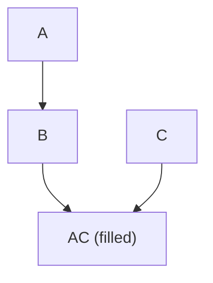
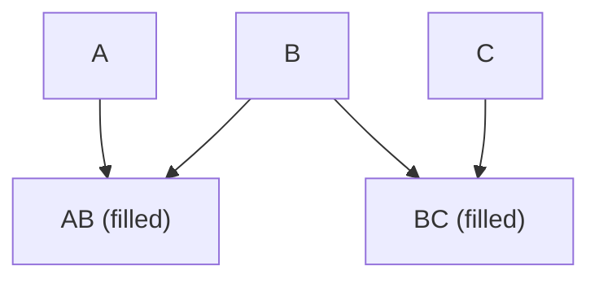

## Illinois Institute of Technology Probabilistic Graphical Models CS - 583 Notes
```math
p(X=1|D) = \frac{\Gamma(2+3)}{\Gamma(2)\Gamma(3)} \left(\frac{1}{3}\right)^2 \left(\frac{2}{3}\right)^1 = 0.5319148936170212
```

`$p(X=1|D) = \frac{\Gamma(2+3)}{\Gamma(2)\Gamma(3)} \left(\frac{1}{3}\right)^2 \left(\frac{2}{3}\right)^1 = 0.5319148936170212$`

This repository contains ai generated notes in 2023 for a class on Probabilistic Graphical Models. 
The notes cover the following topics:
Note: This was used to see how helpful/useful this would be and not all information posted here is 100% correct.  This is mostly ChatGPT in 2023 summarizing this content from the course.

- Formulas
- I Maps
- P MAP (Perfect Map)
- Variable Ordering
- Probability Distributions
- Bayesian to Markov
- Markov to Bayesian
- d-separation and the conditioning set
- Laws of Probability

The notes include examples and explanations of each topic. 

### Formulas

The notes cover a variety of formulas related to Probabilistic Graphical Models, including:

- Bayes' Theorem
- Conditional Probability
- Joint Probability
- Posterior Distribution

### I Maps

The notes include examples and explanations of I Maps for both Bayesian Networks and Markov Networks. 

#### Bayesian Network I Map


#### Markov Network I Map

## iit-pgm 583 repository 2023

