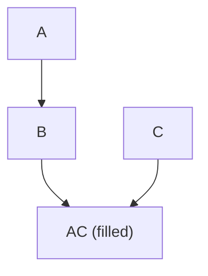
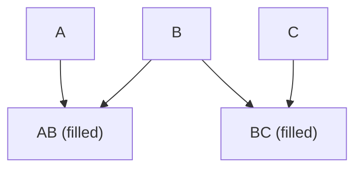

## Probabilistic Graphical Models Notes

This repository contains my notes for a class on Probabilistic Graphical Models. The notes cover the following topics:

- Formulas
- I Maps
- P MAP (Perfect Map)
- Variable Ordering
- Probability Distributions
- Bayesian to Markov
- Markov to Bayesian
- d-separation and the conditioning set
- Laws of Probability

The notes include examples and explanations of each topic. 

### Formulas

The notes cover a variety of formulas related to Probabilistic Graphical Models, including:

- Bayes' Theorem
- Conditional Probability
- Joint Probability
- Posterior Distribution

### I Maps

The notes include examples and explanations of I Maps for both Bayesian Networks and Markov Networks. 

#### Bayesian Network I Map

#### Markov Network I Map

## iit-pgm repository

