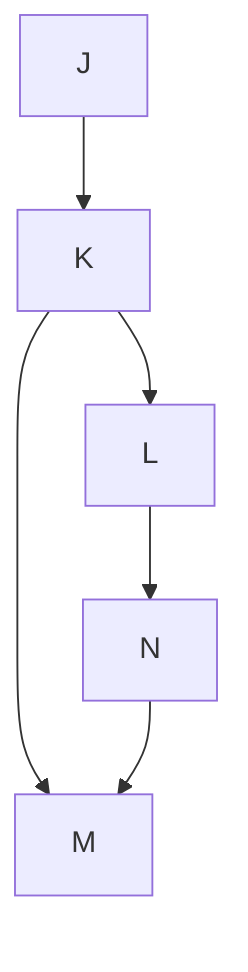

## Variable Order

* Variable order in Bayesian Networks refers to the ordering of the variables in the network. It is used to specify the conditional probability distributions that govern the relationships between the variables in the network.

* The order in which the variables are specified can have a significant impact on the computational efficiency and accuracy of the network. In general, a good variable order is one that minimizes the number of conditional probability distributions that need to be computed during inference. This can be achieved by ordering the variables such that a variable is conditioned only on its parents and not its children, and by ordering the variables in a way that takes into account their mutual information.

* There are several methods for determining the variable order in a Bayesian Network. One common approach is to use a heuristic algorithm such as the min-fill or min-degree algorithm, which aims to minimize the number of fill-in edges that need to be added to the network in order to make it into a chordal graph. Another approach is to use domain-specific knowledge to order the variables based on their causal relationships or their importance in the application.

* Overall, choosing an appropriate variable order is an important step in building an accurate and efficient Bayesian Network model. The choice of variable order can impact the model's performance, computational complexity, and interpretability.

## The Reasons for It

Variable ordering is an essential aspect of some inference algorithms, particularly the Variable Elimination (VE) algorithm, used in probabilistic graphical models like Bayesian networks. It determines the order in which variables are eliminated or summed out when computing marginal probabilities or conditional probabilities for a target variable.

The main reasons we use variable ordering are:

**Efficiency:** The computational complexity of the Variable Elimination algorithm is highly sensitive to the variable ordering. Choosing a good ordering can significantly reduce the time and memory required to perform inference. An optimal variable ordering can minimize the size of the intermediate factors generated during the elimination process, reducing the number of operations required.

**Problem decomposition:** Variable ordering helps break down complex problems into smaller, more manageable subproblems. By eliminating variables one at a time, we can focus on computing the marginal probabilities for a smaller set of variables, which simplifies the overall inference task.

**Trade-offs between complexity and accuracy:** In some cases, it might be preferable to approximate the joint distribution of variables instead of computing the exact distribution. Selecting a specific variable ordering can be a way to balance the trade-off between computational complexity and the accuracy of the computed probabilities.

In summary, variable ordering is crucial for improving the efficiency and manageability of inference algorithms in probabilistic graphical models, like the Variable Elimination algorithm in Bayesian networks. It helps optimize the computational complexity of these algorithms, break down complex problems into smaller subproblems, and balance trade-offs between complexity and accuracy.

## What happens if you choose bad ordering?

**Increased computational complexity:** A poor variable ordering can result in a substantial increase in the size of intermediate factors generated during the elimination process. This, in turn, increases the number of operations required, leading to higher computational complexity and longer runtimes for the inference algorithm.

**Higher memory requirements:** Along with the increased computational complexity, the larger intermediate factors also demand more memory to store them, which can cause memory constraints or even exceed the available memory, making the algorithm infeasible to run.

## How to Choose a Good Ordering

To choose a good variable ordering, you can consider the following heuristics and strategies:

**Min-Fill heuristic:** This heuristic aims to minimize the number of new edges (or "fill-in" edges) that would be added to the graph during the elimination process. The idea is to choose a variable that, when eliminated, creates the least number of fill-in edges. This can help reduce the size of the intermediate factors generated during the elimination process.

**Min-Degree heuristic:** This heuristic involves selecting the variable with the lowest degree (the least number of neighbors) in the graph. The intuition is that eliminating variables with fewer connections to other variables will result in smaller intermediate factors.

**Max-Cardinality heuristic:** This heuristic tries to find an ordering that maximizes the cardinality of the largest clique in the graph at each step. A clique is a set of nodes that are all connected to each other. By maximizing the cardinality, this heuristic aims to minimize the size of the intermediate factors generated during the elimination process.

**Iterative search:** You can perform a search over the space of all possible variable orderings to find the one that minimizes the size of the intermediate factors. This can be computationally expensive, especially for large graphs, but it can be combined with other heuristics to narrow down the search space.

**Random ordering:** In some cases, you can try random variable orderings and evaluate their performance in terms of computational complexity and accuracy. This can help find a suitable ordering, especially when combined with other heuristics or search strategies.

Keep in mind that finding an optimal variable ordering is an NP-hard problem, and often it is not feasible to find the best ordering for large networks. Therefore, these heuristics and strategies serve as approximations that can help find a reasonably good ordering that reduces the complexity of the inference algorithm.

## Examples

1. Example 1

Example 1

Consider a Bayesian network with variables D, E, F, G, and H, with the following structure:

D --> E --> F
|           |
v           v
G --> H --> F

Let's choose a variable ordering: D, E, G, H, F. Here's the variable elimination process:

Eliminate D:

Compute the joint distribution of D, E, G: P(D, E, G) = P(D) * P(E | D) * P(G | D)

Sum out D: P(E, G) = Σ(P(D, E, G), D)

Eliminate E:

Compute the joint distribution of E, F, G, H: P(E, F, G, H) = P(E, G) * P(F | E, H) * P(H | G)

Sum out E: P(F, G, H) = Σ(P(E, F, G, H), E)

Eliminate G:

Sum out G: P(F, H) = Σ(P(F, G, H), G)

Eliminate H:

Sum out H: P(F) = Σ(P(F, H), H)

Finally, the remaining variable is F.

After performing variable elimination, we obtain the marginal probability of F, which is P(F).

Example 2

Consider a Bayesian network with variables J, K, L, M, and N, with the following structure:

Let's choose a variable ordering: J, K, N, L, M. Here's the variable elimination process:

Eliminate J:

Compute the joint distribution of J, K: P(J, K) = P(J) * P(K | J)

Sum out J: P(K) = Σ(P(J, K), J)

Eliminate K:

Compute the joint distribution of K, L, M, N: P(K, L, M, N) = P(K) * P(L | K) * P(M | K) * P(N | M)

Sum out K: P(L, M, N) = Σ(P(K, L, M, N), K)

Eliminate N:

Compute the joint distribution of L, M: P(L, M) = Σ(P(L, M, N), N)

Eliminate L:

Sum out L: P(M) = Σ(P(L, M), L)

Finally, the remaining variable is M.

After performing variable elimination, we obtain the marginal probability of M, which is P(M).

These are two examples of variable ordering problems using Bayesian networks. In both cases, we used variable elimination to compute the marginal probability of the target variable.

## The Variable Elimination Algorithm

Variable Elimination (VE) is a popular exact inference algorithm used in probabilistic graphical models, particularly Bayesian networks. The main idea behind the algorithm is to compute the marginal probability distribution of a target variable by eliminating other variables from the joint probability distribution, one at a time, in a specific order. This is achieved by summing out the variables, which involves computing the sum over all possible values of a variable.

Here's a high-level description of the Variable Elimination algorithm:

Choose a variable ordering for elimination.

For each variable to be eliminated:
a. Identify all factors (probability distributions) that involve the variable.
b. Compute a new factor by multiplying all the identified factors.
c. Sum out the variable from the new factor, resulting in a factor over the remaining variables.
d. Replace the original factors with the new factor in the list of factors.

Compute the marginal probability distribution of the target variable by multiplying the remaining factors.

Let's go through an example to illustrate the algorithm. Consider a simple Bayesian network with variables A, B, and C, and the following conditional probability distributions:

P(A)
P(B | A)
P(C | B)
We want to compute the marginal probability of C, i.e., P(C).

Choose a variable ordering: A, B (C is the target variable, so we won't eliminate it).

Eliminate A:
a. Factors involving A: P(A), P(B | A)
b. New factor: P(A, B) = P(A) * P(B | A)
c. Sum out A: P(B) = Σ P(A, B)
d. Replace original factors: P(B), P(C | B)

Eliminate B:
a. Factors involving B: P(B), P(C | B)
b. New factor: P(B, C) = P(B) * P(C | B)
c. Sum out B: P(C) = Σ P(B, C)
d. Replace original factors: P(C)

The remaining factor is P(C), which is the marginal probability distribution of C.

## Notes

**Variable ordering** is not directly related to the conversion of a Markov network into a Bayesian network. Instead, it is important in the context of performing inference algorithms like Variable Elimination on Bayesian networks.

The conversion from a Markov network to a Bayesian network primarily involves determining a directed acyclic graph (DAG) structure that captures the same set of conditional independencies as the original undirected graph, and then finding the appropriate conditional probability distributions (CPDs) for each variable.

Variable ordering becomes relevant once you have the Bayesian network and want to perform inference on it. It is not directly involved in the conversion process.

To clarify, here's a summary of the conversion and inference steps:

Conversion: Given a Markov network, find a directed acyclic graph (DAG) structure and conditional probability distributions (CPDs) that represent the same set of conditional independencies.

Determine the DAG structure.
Find the CPDs using techniques such as moralization and factorization.
Inference: Once you have the Bayesian network (DAG and CPDs), you can perform inference algorithms like Variable Elimination.

Choose a variable ordering for the Variable Elimination algorithm.
Perform the inference to compute marginal or conditional probabilities for a target variable.

**"Sum out"** is a term used in probability theory and, more specifically, in the context of probabilistic graphical models like Bayesian networks and Markov networks. It refers to the process of eliminating a variable from a joint probability distribution by summing over all possible values of that variable. The result is a marginal probability distribution over the remaining variables.

Mathematically, the process of summing out a variable X from a joint probability distribution P(X, Y, Z) is represented as:

P(Y, Z) = Σ P(X, Y, Z)

Here, we sum over all possible values of X to obtain the marginal probability distribution P(Y, Z) for the remaining variables Y and Z.

In the context of inference algorithms like Variable Elimination, summing out is used to eliminate variables one by one while keeping track of the intermediate factors generated during the elimination process. The purpose is to compute the marginal or conditional probabilities for a target variable, often with reduced computational complexity compared to directly working with the full joint probability distribution.