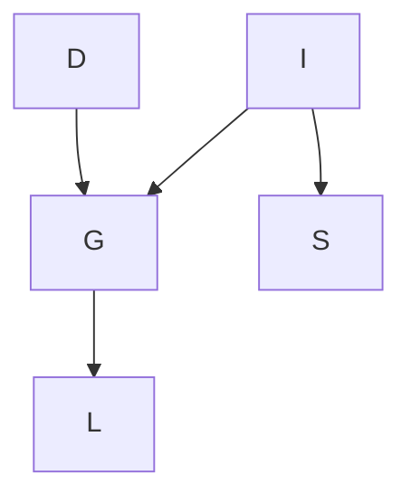

## d separation

1. D independent of G
2. D independent of L
3. D independent of I
4. D independent of I given G
5. D independent of I given L
6. D independent of S given L

In a Bayesian network, d-separation is a graphical criterion for determining whether two sets of variables are independent, given a third set of variables. In particular, d-separation is used to identify conditional independence relationships in the network.

To determine whether two sets of variables are independent given a third set of variables using d-separation, we need to examine the paths between the variables in the Bayesian network. 

A path between two variables is considered "blocked" if it satisfies one of the following conditions:

- It contains a node that is in the conditioning set and has an incoming arrow that is not "observed".
- It contains a node that is not in the conditioning set and has two incoming arrows that are not "observed" or one incoming arrow that is "observed".
- If a path is blocked, then the variables at the ends of the path are considered conditionally independent given the conditioning set. If a path is not blocked, then the variables at the ends of the path are considered dependent given the conditioning set.

The statements one by one (class example):

**D is independent of G.**

To determine whether D is independent of G, we need to examine the paths between these variables in the Bayesian network. The only path between D and G is D -> G. This path is not blocked because there are no nodes in the path that are in the conditioning set. Therefore, D and G are dependent.

**D is independent of L.**

To determine whether D is independent of L, we need to examine the paths between these variables in the Bayesian network. The only path between D and L is D -> G -> L. This path is blocked because G is in the conditioning set and has an incoming arrow that is not observed. Therefore, D and L are independent.

**D is independent of I.**

To determine whether D is independent of I, we need to examine the paths between these variables in the Bayesian network. The only path between D and I is D -> G <- I. This path is not blocked because G is not in the conditioning set and has an incoming arrow that is not observed. Therefore, D and I are dependent.

**D is independent of I given G.**

To determine whether D is independent of I given G, we need to examine the paths between these variables in the Bayesian network. The only path between D and I that passes through G is D -> G <- I. This path is blocked because G is in the conditioning set and has an incoming arrow that is not observed. Therefore, D and I are independent given G.

**D is independent of I given L.**

To determine whether D is independent of I given L, we need to examine the paths between these variables in the Bayesian network. There are two paths between D and I that pass through L: D -> G -> L <- I and D -> G <- I -> S -> L. Both of these paths are not blocked because there are no nodes in the path that are in the conditioning set and have an incoming arrow that is not observed. Therefore, D and I are dependent given L.

**D is independent of S given L.**

To determine whether D is independent of S given L, we need to examine the paths between these variables in the Bayesian network. The only path between D and S that passes through L is D -> G <- I -> S -> L. This path is blocked because I is in the conditioning set and has an incoming arrow that is not observed. Therefore, D and S are independent given L.

In summary, the correct statements are:

- D is dependent on G.
- D is independent of L.
- D is dependent on I.
- D is independent of I given

## The Conditioning Set

- In the context of Bayesian networks, a conditioning set is a set of variables that are used to condition or constrain the probabilities of other variables in the network.

- When we condition on a set of variables, we assume that these variables are known or observed, and we use this information to update our beliefs about the probabilities of other variables in the network. Specifically, when we condition on a set of variables, we calculate the probabilities of the remaining variables given the values of the conditioning variables.

- For example, suppose we have a Bayesian network with two variables, X and Y, where X is the parent of Y. If we want to calculate the probability of Y given that X is observed to be true, we can condition on X by setting its value to true and then calculating the conditional probability of Y given X=true. This conditioning set consists of a single variable, X, and it constrains the probabilities of Y based on the observed value of X.

- In general, the size and composition of the conditioning set can have a significant impact on the results of Bayesian inference. A large conditioning set may provide more information to update the probabilities of the other variables, but it can also lead to more complex calculations and slower inference. A carefully chosen conditioning set that captures the most relevant information can often strike a balance between these competing considerations.
